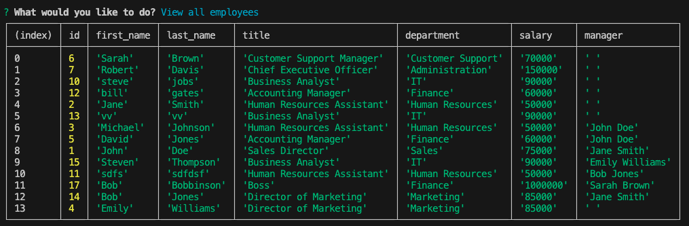
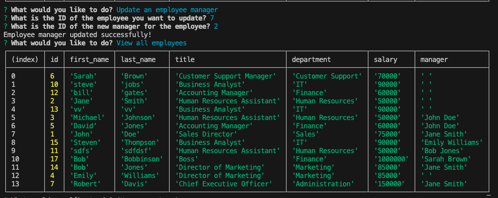
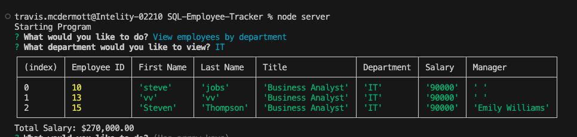

  # SQL Employee Tracker

  

  ## Description
  This is command line interface application that allows you to manage a database of employees

  ## Repository of Deployed Application

  https://github.com/tjmcd2010/SQL-Employee-Tracker

  ## Demonstration of Deployed Application

  [SQL Employee Tracker Demo](https://drive.google.com/file/d/1qyFH36vXbsQsiokfuh43Ga_-KnWE7d0W/view?usp=sharing)

  ## Screenshot of Deployed Application

  
  
  

  
  
  ## Table of Contents
  - [Installation](#installation)
  - [Usage](#usage)
  - [Contributing](#contributing)
  - [Tests](#tests)
  - [Technologies](#technologies)
  - [License](#license)
  - [Questions](#questions)

  ## Installation
  You will need to clone the repository from Github on to your local machine

  ## Usage
  Update a SQL database via a command line menu and prompts

  ## Contributing
  N/A

  ## Tests
  Simply enter "Node Server" to bring up the main menu and you will be prompted for all possible options

  ## Technologies
  
  SQL, JSON, Javascript, Command Line Interface, Inquirer, Express, Postgresql

   ## License
  MIT

  ## Questions

  For any additional questions or feedback, please contact me with the following information:
  Github: (https://github.com/tjmcd2010)
  Email: (mailto:tjmcd2010@gmail.com)  

